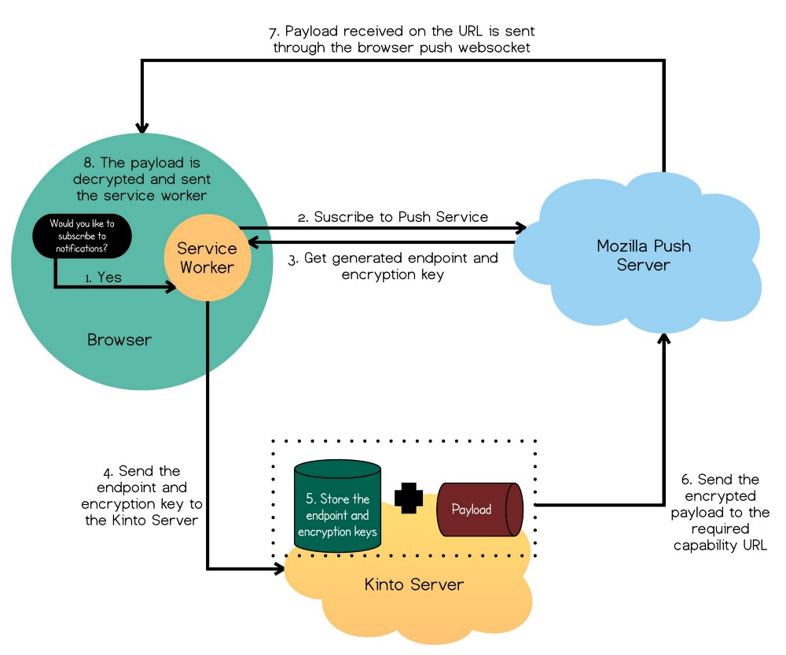

Overview
========

What is WebPush?
----------------

WebPush is the web standard to allow a server to notify its client
that something changed.

In your webapp you ask the browser for a subscription, you start a
service-worker that will handle notifications and you send your
subscription to the server so that it can send you notifications.

          browser and the Mozilla Push Server

    Example of how we could use WebPush with Kinto.

For more about WebPush, do not hesitate to `read this article <https://medium.com/@mansimarkaur.mks/the-what-and-how-of-web-push-69209dd144f7>`_

What is this WebPush Channel Broadcasting service about?
--------------------------------------------------------

**tl;dr Broadcasting notifications using WebPush made simple.**

Handling sending notifications to a large number of users for a web
service might be a problem.

- It can slow down the request response time by a lot, or you need to
  spawn tasks workers (i.e celery, rq))
- You need to store and retrieve the subscription and have endpoint
  for your clients to manage them.
- You need to handle errors, retry, etc.

The WebPush Channel broadcasting service follow the micro-services
philosophy and handle all these tasks for you:

- It will allow you to notify all your users with one simple HTTP POST
  request that will be accepted in milliseconds.
- It will automatically handle the load of sending thousands of
  notifications, encrypt them specifically for each subscription.
- It will allow your users to manage their subscriptions and the list
  of channels they are listening to.
- It will handle errors and retry.
